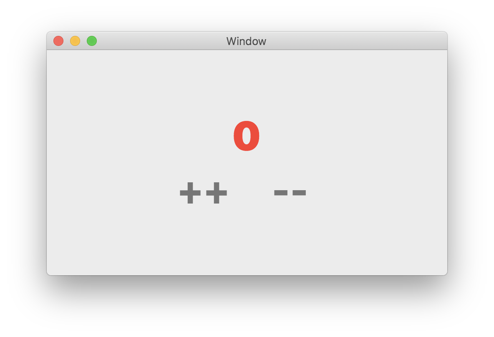

# Mvce — Event driven MVC

**/myo͞oz/**

An event driven MVC library to glue decoupled Model, View, and Controller for UIKit/AppKit. Minimal, simple, and unobtrusive.

本文档同时提供[简体中文版](README.zh_CN.md)。

## Why

UIKit/AppKit is mainly about view. Don't be misled by the `Controller` in `UIViewController`/`NSViewController` and descendants, they are all views, should be avoided things that belong to controller, such as networking, model updating.

How to glue view, model, and controller is upon to you, UIKit/AppKit has no strong options on that. Typically, as the (bad) official examples show to us, we define a model, refer it inside `UIViewController`/`NSViewController`s, and manipulate the model directly. It works like a...charm?

No, it's MVC without C, it's strong coupling, it's not reusable(for crossing UIKit and AppKit), if you care, it's also untestable.

## How

The key idea of MVC is separation for Model, View, and Controller. To glue 'em, Mvce provides an alternative way.

Let's take a taste of Mvce first, here is a simple counter app:


All code shows below:

```swift
// Model to represent count
final class CounterModel: NSObject {
  @objc dynamic var count = 0
}

// Event to represent behavior for button ++ and --
enum CounterEvent {
  case increment
  case decrement
}

// Controller to represent how to update model
struct CounterController: Controller {
  typealias Model = CounterModel
  typealias Event = CounterEvent

  func update(model: CounterModel, for event: CounterEvent) {
    switch event {
    case .increment:
      model.count += 1
    case .decrement:
      model.count -= 1
    }
  }
}

// View to represent model state, and emit event to notify controller to update model
final class ViewController: UIViewController {
  @IBOutlet weak var label: UILabel!
  @IBOutlet weak var incrButton: UIButton!
  @IBOutlet weak var decrButton: UIButton!

  override func viewDidLoad() {
    super.viewDidLoad()
    // Don't forget to glue 'em all here
    // And don't worry, lifetime is managed
    Mvce.glue(model: CounterModel(), view: self, controller: CounterController())
  }

  @objc private func incr(_ sender: Any?) {
    emit(event: .increment)
  }

  @objc private func decr(_ sender: Any?) {
    emit(event: .decrement)
  }
}

// Adopt `View` protocol to bind model and event emitter.
// When event emitter is required outside `bind(eventEmitter:)`,
// just adopt `EventEmitter`.
// (curse the target-action pattern! You can pass nothing to the selector,
// that say, no chance to inject dependency)
extension ViewController: View, EventEmitter {
  typealias Model = CounterModel
  typealias Event = CounterEvent

  func bind(model: CounterModel) -> Invalidator {
    return Mvce.flatKVObservations([
      model.bind(\.count, to: label, at: \.text) { String(format: "%d", $0) }
    ])
  }

  func bind(eventEmitter: (CounterEvent) -> Void) {
    incrButton.addTarget(self, action: #selector(incr(_:)), for: .touchUpInside)
    decrButton.addTarget(self, action: #selector(decr(_:)), for: .touchUpInside)
  }
}
```

### Decouple View and Model

Take a careful look at our `ViewController`, there's no any reference to model! Just adopt `View` protocol and bind model's count to label inside `func bind(model:) -> Invalidator`. Mvce provides some wrapper for `func observe<Value>(_ keyPath: KeyPath<Self, Value>, options: NSKeyValueObservingOptions = default, changeHandler: @escaping (Self, NSKeyValueObservedChange<Value>) -> Void) -> NSKeyValueObservation`, KVO has never been such easier.

```swift
public extension NSObjectProtocol where Self : NSObject {
  func bind<V, V2, T>(_ keyPath: KeyPath<Self, V>, transform: @escaping (V) -> V2, to target: T, using binder: @escaping (T, V2) -> Void) -> NSKeyValueObservation
  func bind<V, T>(_ keyPath: KeyPath<Self, V>, to target: T, using binder: @escaping (T, V) -> Void) -> NSKeyValueObservation
  func bind<V, T, U>(_ keyPath: KeyPath<Self, V>, to target: T, at targetKeyPath: ReferenceWritableKeyPath<T, U>, transform: @escaping (V) -> U) -> NSKeyValueObservation
  func bind<V, T>(_ keyPath: KeyPath<Self, V>, to target: T, at targetKeyPath: ReferenceWritableKeyPath<T, V>) -> NSKeyValueObservation
}
```

Mvce manages the observation lifetime, once you return an invalidation closure `() -> Void` which Mvce typealias to `Invalidator`. Mvce also provides `static func flatKVObservations(_ observations: [NSKeyValueObservation]) -> Invalidator` to flat multiple observations to an `Invalidator`.

### Decouple View and Controller

There is no any reference to controller inside view too! `View` protocol also requires you bind event emitter. What's an event emitter? Just a closure `(Event) -> Void`, you can use it to emit event, Mvce will dispatch event to controller and inform it to update model.

Unfortunately, control elements in UIKit/AppKit use target-action pattern, we can't pass the event emitter to action selector. So adopting `EventEmitter` is required to use `emit(event:)` outside `bind(eventEmitter:)`. If you use 3rd library that uses closure for controls, adopting `EventEmitter` is not necessary.

Event is essential part of Mvce. Event can be triggered by user from view, also can come from app itself, e.g. networking, clock tick etc.. In such cases, you can make controller confirming to `EventEmitter`, use `emit(event:)` to emit event inside controller programmatically.

### Glue Model, View, and Controller together

Glue 'em all with `Mvce.glue(model:view:controller:)`, inject to `loadView` or `viewDidLoad` in `UIViewController`/`NSViewController`. And lifetime is managed by Mvce.

### Cross-Platform (iOS & macOS)?

Sure, that's *REAL* MVC's advantage! Model and Controller can be shared, only platform-independent view is required to rewrite.

```swift
class ViewController: NSViewController {
  @IBOutlet weak var label: NSTextField!
  @IBOutlet weak var incrButton: NSButton!
  @IBOutlet weak var decrButton: NSButton!

  override func viewDidLoad() {
    super.viewDidLoad()
    Mvce.glue(model: CounterModel(), view: self, controller: CounterController())
  }

  @objc private func incr(_ sender: Any?) {
    emit(event: .increment)
  }

  @objc private func decr(_ sender: Any?) {
    emit(event: .decrement)
  }
}

extension ViewController: View, EventEmitter {
  typealias Model = CounterModel
  typealias Event = CounterEvent

  func bind(model: CounterModel) -> Invalidator {
    return Mvce.flatKVObservations([
      model.bind(\.count, to: label, at: \.stringValue) { String(format: "%d", $0) }
      ])
  }

  func bind(eventEmitter: (CounterEvent) -> Void) {
    incrButton.target = self
    incrButton.action = #selector(incr(_:))
    decrButton.target = self
    decrButton.action = #selector(decr(_:))
  }
}
```



That's it! Remember to check out [Example](Example) directory for a more complex one.

## License

MIT

## Author

- Blog: [realazy.com](https://realazy.com) (Chinese)
- Github: [@cxa](https://github.com/cxa)
- Twitter: [@_cxa](https://twitter.com/_cxa) (Chinese mainly)
