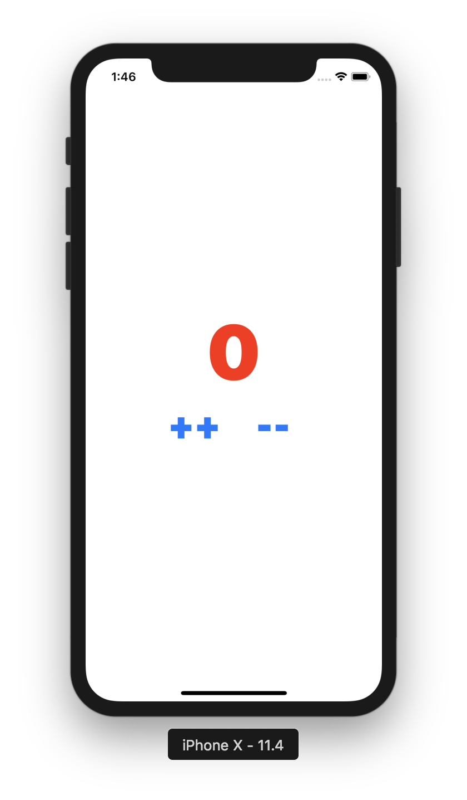

# Mvce — 事件驱动的 MVC 库

**/缪斯/**

Mvce 是一个事件驱动的 MVC 辅助库，用于组合分离的模块、视图和控制器，UIKit 和 AppKit 适用。

Also available in [English](README.md).

## 缘由

UIKit/AppKit 提供的主要是视图。不要被 `UIViewController`/`NSViewController` 及其子类中的 `Controller` 误导，它们都属于视图，永远不该有属于控制器的逻辑，比如网络请求、更新模块等。

UIKit/AppKit 没有强制规定组合模型、视图和控制器的方法，如何去做取决于你。通常做法是，就像官方提供的那些（坏）例子，定义模型，在 `UIViewController`/`NSViewController` 引用，直接操作模型。如丝般……柔滑？

并不！这只不过是没有 C 的 MVC，强耦合、无重用、难测试！

## 大法

MVC 模式强调的是模型、视图和控制器分离，如何组合它们，Mvce 提供一套以事件为核心的方法。

以这款长这样的计数程序为例，



先品品 Mvce 的风味，有码奉上：

```swift
// 表示计数的模型
final class CounterModel: NSObject {
  @objc dynamic var count = 0
}

// 按钮 ++ 和 -- 的事件
enum CounterEvent {
  case increment
  case decrement
}

// 处理不同的事件，更新模型的控制器
struct CounterController: Controller {
  typealias Model = CounterModel
  typealias Event = CounterEvent

  func update(model: CounterModel, for event: CounterEvent, eventEmitter: @escaping (Event) -> Void) {
    switch event {
    case .increment:
      model.count += 1
    case .decrement:
      model.count -= 1
    }
  }
}

// 按钮事件处理器
class ButtonAction: NSObject {
  let emit: (CounterEvent) -> Void

  init(emit: @escaping (CounterEvent) -> Void) {
    self.emit = emit
  }

  @objc func incr(_ sender: Any?) {
    emit(.increment)
  }

  @objc func decr(_ sender: Any?) {
    emit(.decrement)
  }
}

// 呈现模型状态的视图，用「事件发射器」（event emitter）传送事件通知控制器更新模型
final class ViewController: UIViewController {
  @IBOutlet weak var label: UILabel!
  @IBOutlet weak var incrButton: UIButton!
  @IBOutlet weak var decrButton: UIButton!

  override func viewDidLoad() {
    super.viewDidLoad()
    // 别忘了在这里组合模型、视图和控制器，别担心，Mvce 管理它们生命周期
    Mvce.glue(model: CounterModel(), view: self, controller: CounterController())
  }
}

// 遵循 `View` 协议，绑定模型和事件发射器。
extension ViewController: View {
  typealias Model = CounterModel
  typealias Event = CounterEvent

  func bind(model: CounterModel) -> Invalidator {
    return Mvce.flatKVObservations([
      model.bind(\.count, to: label, at: \.text) { String(format: "%d", $0) }
    ])
  }

  func bind(eventEmitter: @escaping (CounterEvent) -> Void) {
    let action = ButtonAction(emit: eventEmitter)
    incrButton.addTarget(action, action: #selector(action.incr(_:)), for: .touchUpInside)
    decrButton.addTarget(action, action: #selector(action.decr(_:)), for: .touchUpInside)
    // 需 retain target
    let key: StaticString = #function
    objc_setAssociatedObject(self, key.utf8Start, action, .OBJC_ASSOCIATION_RETAIN_NONATOMIC)
  }
}
```

### 分离模型和视图

仔细看视图 `ViewController` 的代码，你会发现没有任何模型的引用！只需遵循 `View` 协议，并在 `func bind(model:) -> Invalidator` 里绑定模型。Mvce 提供一些包装 `func observe<Value>(_ keyPath: KeyPath<Self, Value>, options: NSKeyValueObservingOptions = default, changeHandler: @escaping (Self, NSKeyValueObservedChange<Value>) -> Void) -> NSKeyValueObservation` 的辅助方法，KVO 从来没有如此容易过！

```swift
public extension NSObjectProtocol where Self : NSObject {
  func bind<V, V2, T>(_ keyPath: KeyPath<Self, V>, transform: @escaping (V) -> V2, to target: T, using binder: @escaping (T, V2) -> Void) -> NSKeyValueObservation
  func bind<V, T>(_ keyPath: KeyPath<Self, V>, to target: T, using binder: @escaping (T, V) -> Void) -> NSKeyValueObservation
  func bind<V, T, U>(_ keyPath: KeyPath<Self, V>, to target: T, at targetKeyPath: ReferenceWritableKeyPath<T, U>, transform: @escaping (V) -> U) -> NSKeyValueObservation
  func bind<V, T>(_ keyPath: KeyPath<Self, V>, to target: T, at targetKeyPath: ReferenceWritableKeyPath<T, V>) -> NSKeyValueObservation
}
```

一旦你返回一个 `() -> Void`（Mvce 另名为 `Invalidator`），Mvce 会帮你管理这些绑定的生命周期。Mvce 还可以帮你将多个绑定的 `NSKeyValueObservation` 平铺为一个`Invalidator`：`static func flatKVObservations(_ observations: [NSKeyValueObservation]) -> Invalidator`。

### 分离视图和控制器

视图中也没有控制器的任何引用！`View` 协议除了要求绑定模型，还要求绑定事件发射器。何为事件发射器？只不过是一个 `(Event) -> Void` 的函数。用它来传送事件，Mvce 会分发给控制器，通知控制器更新模型。

### 组合模型、视图和控制器

在 `UIViewController`/`NSViewController` 的 `loadView` or `viewDidLoad` 里使用 `Mvce.glue(model:view:controller:)` 来组合它们。Mvce 会管理它们的生命周期。

### 跨平台（iOS & macOS）？

开玩笑，这可是「真·MVC」的最大好处之一。模型和控制器可共用，重写平台特定的视图就行了：

```swift
class ViewController: NSViewController {
  @IBOutlet weak var label: NSTextField!
  @IBOutlet weak var incrButton: NSButton!
  @IBOutlet weak var decrButton: NSButton!

  override func viewDidLoad() {
    super.viewDidLoad()
    Mvce.glue(model: CounterModel(), view: self, controller: CounterController())
  }
}

extension ViewController: View {
  typealias Model = CounterModel
  typealias Event = CounterEvent

  func bind(model: CounterModel) -> Invalidator {
    return Mvce.flatKVObservations([
      model.bind(\.count, to: label, at: \.stringValue) { String(format: "%d", $0) }
    ])
  }

  func bind(eventEmitter: @escaping (CounterEvent) -> Void) {
    let action = ButtonAction(emit: eventEmitter)
    incrButton.target = action
    incrButton.action = #selector(action.incr(_:))
    decrButton.target = action
    decrButton.action = #selector(action.decr(_:))
    // 需 retain target
    let key: StaticString = #function
    objc_setAssociatedObject(self, key.utf8Start, action, .OBJC_ASSOCIATION_RETAIN_NONATOMIC)
  }
}
```


就这么多！[Example](Example) 目录下还有复杂点儿的例子，不妨看看。

### `EventEmitter` 协议

如果真的非常需要在 View 和 Controller 的任何角落里使用事件发射器，只需遵循让它们 `EventEmitter`。然而我不建议你这么做，这非常容易导致混乱的代码，破坏 MVC 的法则。

## 授权

MIT

## 作者

- Blog: [realazy.com](https://realazy.com)
- Github: [@cxa](https://github.com/cxa)
- Twitter: [@_cxa](https://twitter.com/_cxa)
